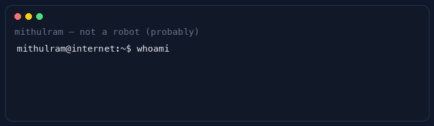

<!--
  oh hey — you found the source code of a person.
  mascot by mithulram · mint + navy · proof at the boundary
-->

<table align="center">
  <tr>
    <td align="center" width="210">
      
      
       
      📡 broadcasting from <b>Germany</b> · online
    </td>
    <td valign="middle">
      
        
      
      
      
    </td>
  </tr>
</table>

  

<em>Building software that turns uncertainty at the boundary into evidence.</em>

## The pin board

Six repos pinned below — that's the whole highlight reel. No homework archives, no snake games.

<b>↳ tap for quick links (if you hate scrolling)</b>

| | |
|:---:|:---|
| 💸 | **[RupeeRoute](https://github.com/mithulram/rupee-route)** — sandbox fintech, fake money only |
| 🔐 | **[Secure Asset Access API](https://github.com/mithulram/secure-asset-access-api)** — Java API that says "no" loudly |
| 🧪 | **[Data Quality Pipeline](https://github.com/mithulram/data-quality-lineage-pipeline)** — bad rows go to quarantine |
| 📡 | **[Service Health Monitor](https://github.com/mithulram/service-health-incident-monitor)** — SLOs, metrics, panic-but-make-it-readable |
| 🚗 | **[Automotive Sec Bench](https://github.com/mithulram/automotive-security-test-bench)** — ECU threats, scored & reported |
| 🔋 | **[Battery Telemetry Harness](https://github.com/mithulram/battery-telemetry-validation-harness)** — C++ says "nope" to bad volts |

## What I actually do

I make software that survives contact with reality — APIs with explicit permissions, pipelines that quarantine garbage instead of shipping it, dashboards that tell the truth, and tests that enjoy breaking things.

> Soft spot: systems calmer than a Friday deploy. Hard spot: vague "it works on my machine" energy.

## How I work

**Honest demos** · **designed failures** · **clear boundaries** · **receipts included** (tests, CI, docs)

> [!TIP]
> Want the scenic route? My [portfolio](https://mithulram-portfolio.vercel.app) has the visuals. Want the receipts? Scroll to the pins.

---

`status: online · caffeinated · will refactor your validation layer for fun`

 

