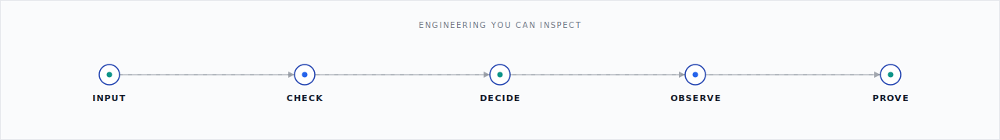

# Engineering you can inspect.

**Mithulram Gunasekaran** · Software Engineer 
Java, Python & secure systems · Passau, Germany

<a href="https://mithulram-portfolio.vercel.app">
  <picture>
    <source media="(prefers-color-scheme: dark)" srcset="assets/cta-portfolio-dark.svg">
    
  </picture>
</a>
&nbsp;
<a href="https://www.linkedin.com/in/mithulram-g-926ba520a">
  <picture>
    <source media="(prefers-color-scheme: dark)" srcset="assets/cta-linkedin-dark.svg">
    
  </picture>
</a>

<picture>
  <source media="(prefers-color-scheme: dark)" srcset="assets/evidence-hero-dark.svg">
  
</picture>

I build backend and data systems where trust is designed in: explicit permissions, quarantined bad records, observable services, and tests that respect the unhappy path.

## The work

I build software for the moments when “it works” is not enough: APIs with explicit permissions, data pipelines that quarantine bad inputs, operational tools that explain what is happening, and tests that take the unhappy path seriously.

> I like production systems calm enough that Friday can remain a weekday.

## Three things worth opening

### [RupeeRoute](https://github.com/mithulram/rupee-route)

A sandbox remittance-platform monorepo with integer money, transfer state machines, double-entry ledger concepts, role-aware operations, and deterministic provider integrations.

`TypeScript` · `NestJS` · `Next.js` · `PostgreSQL`

*Sandbox only—no live money movement, customer funds, or regulatory authorization.*

### [Secure Asset Access API](https://github.com/mithulram/secure-asset-access-api)

A Java/Spring Boot API for classified technical assets with validated REST endpoints, role-based authorization, JPA persistence, audit events, health checks, and security integration tests.

`Java` · `Spring Boot` · `Spring Security` · `JPA`

*Portfolio demonstrator; runtime asset-level grant evaluation is intentionally out of scope.*

### [Data Quality & Lineage Pipeline](https://github.com/mithulram/data-quality-lineage-pipeline)

A Python/DuckDB pipeline that validates source data, quarantines invalid records, enriches trusted data, exports CSV and Parquet, and records quality and lineage artefacts.

`Python` · `DuckDB` · `SQL` · `Parquet`

*Uses synthetic source data to demonstrate a reproducible local analytical workflow.*

<strong>More systems in the pinned collection</strong>

- [Service Health & Incident Monitor](https://github.com/mithulram/service-health-incident-monitor) — FastAPI health checks, Prometheus-format metrics, incidents, and SLO/error-budget reasoning.
- [Automotive Security Test Bench](https://github.com/mithulram/automotive-security-test-bench) — reproducible ECU threat scenarios, risk prioritisation, and JSON/HTML reporting.
- [Battery Telemetry Validation Harness](https://github.com/mithulram/battery-telemetry-validation-harness) — C++17 validation rules, deterministic quarantine, CMake/CTest, and Python fault injection.

## How I think

Explicit permissions · bad data belongs in quarantine · observability is a product feature · failure paths deserve tests

## Core stack

<picture>
  <source media="(prefers-color-scheme: dark)" srcset="assets/core-stack-dark.svg">
  
</picture>

Java · Spring Boot · Python · DuckDB · TypeScript · C++

> [!TIP]
> Want the visual product tour? Start with my [portfolio](https://mithulram-portfolio.vercel.app). Want implementation detail? The pinned repositories below have the receipts.

Currently pursuing an M.Sc. in Computer Science at the University of Passau.

`careful by default · curious on purpose`
